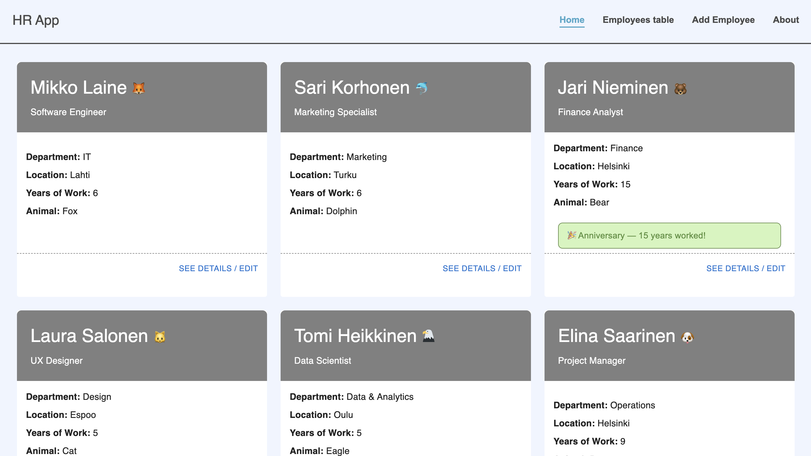
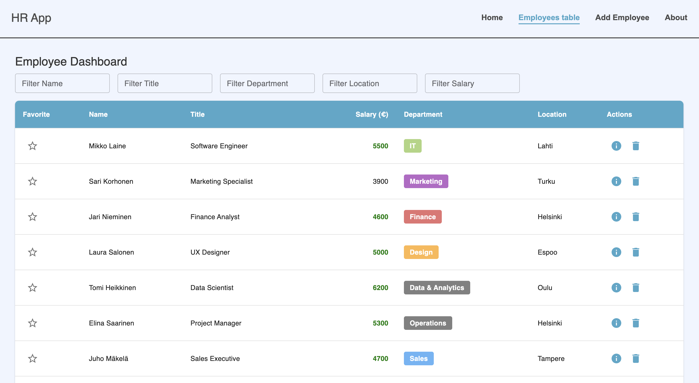

# 🧑‍💼 HR App

**HR App** is a learning project built with React and JSON Server. 

The application allows you to view, add, and edit employee information, with all data persisted on a mock backend. 

>The project is deployed on Render, where both frontend and backend run in a single process.





🔗 **Live demo:** _(https://hrapp-xsbf.onrender.com/)_

---

## 🛠️ Tech Stack

- **Frontend:** React 18, Vite

- **Backend:** JSON Server (mock API)

- **Styling:** CSS Modules

- **Deployment:** Render (frontend + backend in one process)

- **Utilities:** Axios, Custom Hooks (useAxios)

---

## 🗂️ Project Structure
```bash
hrApp/
├── src/
│   ├── components/ # React components (Header, Footer, PersonCard, SummaryPersonCard, EmployeeForm)
│   ├── hooks/      # Custom hooks (useAxios)
│   ├── pages/      # React pages (About, PersonList, AddEmployee, EmployeesPage)
│   └── App.jsx     # Main app
├── db.json         # JSON Server database
├── package.json
├── vite.config.js
└── README.md
```
---

## ⚙️ Running the Project Locally

### 1️⃣ Clone the repository
```bash
git clone https://github.com/Kopiika/hrApp.git
cd hrApp
```
### 2️⃣ Install dependencies
```bash
npm install
```

### 3️⃣ Start the application (frontend + backend)
```bash
npm run server
```

The application will be available at: `http://localhost:3001`

>The server script builds the frontend and runs JSON Server simultaneously, serving the API and static files from `dist`.

---

## 🏆 Achievements / Features

- **Employee Directory:** Dynamic list of employees displayed via `PersonCard` components. Conditional reminders are displayed based on tenure:
  - 🎉 Recognition for 5, 10, 15+ years of service
  - 🔔 Probation review for less than 6 months of service
- **Add Employee:** Form to add new employees, with controled state and skills parsed into an array.
- **Edit Employee:** Inline editing for salary, location, department, and skills; PATCH requests update JSON Server and local state.
- **JSON Server Integration:** 
  - Backend runs on `db.json` simulating a real API.
  - Frontend fetches and posts employee data using Axios.
- **Render Deployment:** Frontend and backend run together using a single command:
  ```bash
  npm run server
  ```
- **Reusable Axios Hook:** useAxios for GET, POST, and PATCH requests.

- **Component Styling:** Consistent UI using CSS Modules.

- **Clean Code & Component Structure:** Components split into reusable pieces; logic, layout, and styles organized clearly.

---

## 🌱 What I Learned

- Designed scalable React component structures

- Managed shared state across multiple pages

- Integrated REST API with JSON Server for CRUD operations

- Implemented inline editing and conditional rendering

- Deployed fullstack app on Render with combined frontend/backend

- Debugged deployment and build issues in a fullstack context

---

## 📜 License

This project was created for educational purposes only.